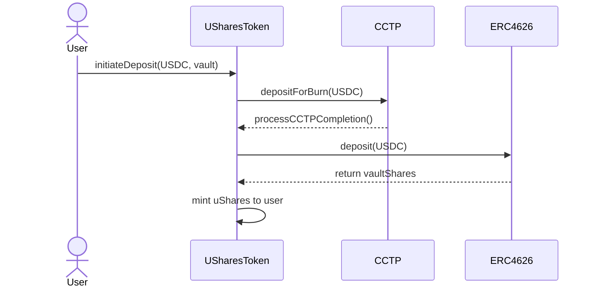

# uShares Protocol

## Overview
uShares is a cross-chain protocol that enables users to access ERC4626 vault yields across different chains while maintaining their position on their source chain. By using Circle's CCTP for USDC bridging, users can deposit USDC on one chain and gain exposure to vault yields on another chain, receiving uShares tokens that represent their vault position.

## Features
- Cross-chain ERC4626 vault exposure
- Source chain position management
- USDC-denominated shares
- Seamless integration with Circle's CCTP
- Standardized CCT (Cross-Chain Token) implementation

## Architecture

### Key Components
- **USharesToken**: Main contract handling deposits and share minting
- **VaultRegistry**: Manages supported vaults across chains
- **PositionManager**: Tracks user positions and share balances
- **CCTP Integration**: Handles cross-chain USDC transfers

### Flow Diagram


## Installation

```bash
git clone https://github.com/yourusername/ushares-protocol
cd ushares-protocol
forge install
```

## Usage

### Deploy Contracts
```bash
forge script scripts/deploy.s.sol --rpc-url  --broadcast
```

### Run Tests
```bash
forge test
```

### Example: Deposit USDC for Vault Shares
```solidity
// 1. Approve USDC
IERC20(USDC).approve(address(uSharesToken), amount);

// 2. Initiate deposit
bytes32 depositId = uSharesToken.initiateDeposit(
    targetVault,
    usdcAmount,
    destinationChainSelector,
    minShares,
    deadline
);
```

## Configuration

### Environment Variables
Create a `.env` file:
```env
PRIVATE_KEY=your_private_key
RPC_URL=your_rpc_url
ETHERSCAN_API_KEY=your_api_key
```

### Supported Networks
- Ethereum Mainnet
- Base
- Arbitrum
- Optimism
- (Add more chains as needed)

## Contract Addresses

### Mainnet
- USharesToken: `0x...`
- VaultRegistry: `0x...`
- PositionManager: `0x...`

### Base
- Vault: `0x...`
(Add other chains)

## Development

### Prerequisites
- Foundry
- Node.js >= 14
- Git

### Local Setup
1. Clone repository
2. Install dependencies
3. Copy `.env.example` to `.env`
4. Configure environment variables

### Testing
```bash
# Run all tests
forge test

# Run specific test
forge test --match-test testDeposit

# Run with verbosity
forge test -vvv
```

## Security

### Audits
- [Audit 1](link_to_audit) - Date
- [Audit 2](link_to_audit) - Date

### Bug Bounty
Visit our [bug bounty program](link) for details.

## Contributing
1. Fork the repository
2. Create feature branch
3. Commit changes
4. Push to branch
5. Create Pull Request

## License
MIT

## Contact & Support
- Discord: [Join](link)
- Twitter: [@uShares](link)
- Email: support@ushares.xyz

## Documentation
Full documentation available at [docs.ushares.xyz](link)
