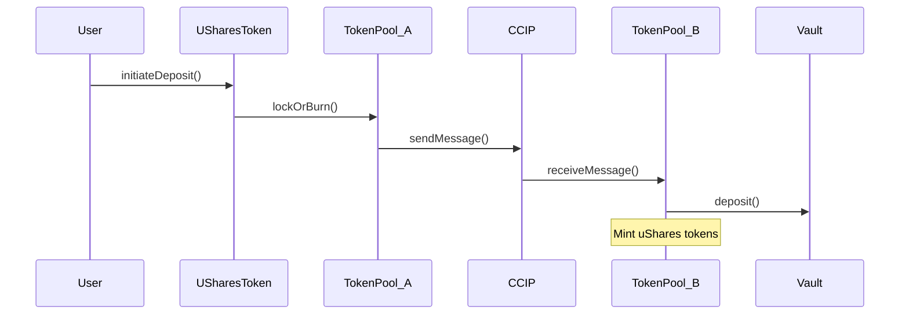

# uShares Protocol

uShares is a cross-chain ERC4626 vault share tokenization protocol that enables users to access yield opportunities across different blockchains through a single unified token. Built on Chainlink's CCT (Cross-Chain Token) standard and Circle's CCTP, uShares provides a seamless and secure way to interact with vaults across multiple chains.

## Overview

The protocol enables:
- Single-token representation of cross-chain vault positions
- Seamless USDC bridging via Circle's CCTP
- Secure cross-chain messaging via Chainlink's CCT
- Automated position management across chains

## Architecture

### Core Components

1. **USharesToken**
   - Single unified ERC20 token implementing CCT standard
   - Deployed on issuing chain
   - Integrates with token pools for cross-chain movement
   - Manages token supply and user balances

2. **Token Pools**
   ```mermaid
   graph TD
      A[Issuing Chain] --> |LockReleaseTokenPool| B[Token Movement]
      B --> |BurnMintTokenPool| C[Other Chains]
      C --> |BurnMintTokenPool| B
      B --> |LockReleaseTokenPool| A
   ```
   - **Issuing Chain**: LockReleaseTokenPool
     - Locks tokens when moving to other chains
     - Releases tokens when returning from other chains
   
   - **Other Chains**: BurnMintTokenPool
     - Burns tokens when moving to other chains
     - Mints tokens when receiving from other chains

3. **VaultRegistry**
   - Manages supported ERC4626 vaults
   - Validates vault operations
   - Tracks vault shares and status
   - Monitors share price changes

4. **PositionManager**
   - Tracks user positions across chains
   - Manages vault share balances
   - Handles cross-chain position updates

### Cross-Chain Architecture



## Key Features

### Cross-Chain Integration
- **CCTP Integration**: Secure USDC bridging
- **CCT Standard**: Unified token movement
- **Rate Limiting**: Per-chain transfer limits
- **Message Verification**: Cross-chain security

### Security Features
- **Role-Based Access**
  - Admin roles
  - Token pool management
  - Vault operations
  
- **Transfer Safety**
  - Rate limiting
  - Allowlist management
  - Fee configuration
  
- **Vault Security**
  - Share price monitoring
  - Slippage protection
  - Operation timeouts

## Usage

### For Users

1. **Deposit Flow**
```typescript
// Deposit USDC to get vault exposure
const tx = await uSharesToken.initiateDeposit({
    vault: vaultAddress,
    amount: usdcAmount,
    destinationChain: chainId,
    minShares: minSharesExpected,
    deadline: deadline
});
```

2. **Withdrawal Flow**
```typescript
// Withdraw USDC from vault position
const tx = await uSharesToken.initiateWithdrawal({
    vault: vaultAddress,
    shares: shareAmount,
    destinationChain: chainId,
    minUsdc: minUsdcExpected,
    deadline: deadline
});
```

### For Integrators

1. **Token Pool Setup**
```solidity
// Deploy and configure token pool
const pool = await TokenPoolFactory.deploy({
    isIssuingChain: false,
    token: uSharesToken,
    cctp: cctpAddress
});

// Configure rate limits
await pool.setRateLimits(
    destinationChainSelector,
    ratePerSecond,
    capacity
);
```

2. **Vault Integration**
```solidity
// Register vault in registry
await vaultRegistry.registerVault(
    chainId,
    vaultAddress
);

// Configure vault in position manager
await positionManager.configureVault(
    chainId,
    vaultAddress,
    true
);
```

## Development

### Prerequisites
- Foundry
- Node.js
- Circle CCTP API Key
- Chainlink CCIP API Key

### Installation
```bash
git clone https://github.com/yourusername/uShares.git
cd uShares
forge install
```

### Testing
```bash
# Run all tests
forge test

# Run with coverage
forge coverage

# Run specific test file
forge test --match-path test/USharesToken.t.sol
```

### Deployment
```bash
# Set environment variables
cp .env.example .env
# Edit .env with your values

# Deploy contracts
forge script script/Deploy.s.sol --rpc-url $RPC_URL --broadcast
```

## Security

### Audits
- Smart contract audits: Pending
- Security contact: security@ushares.com

### Features
- Pausable operations
- Role-based access control
- Rate limiting
- Emergency recovery functions

## License

MIT

## Contributing

1. Fork the repository
2. Create your feature branch
3. Commit your changes
4. Push to the branch
5. Create a Pull Request
